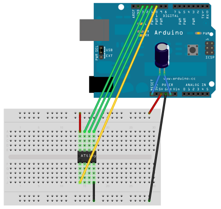

# FranzBoot

Programa para gravação do bootloader micronucleus para Franzininho DIY usando Arduino UNO

Desenvolvido por Limor Fried e Bill Westfield. Adaptado em 03/02/2021 por [Daniel Quadros (aka DQ)](https://dqsoft.blogspot.com/) para gravação do Micronucleus para o projeto Franzininho

## Instruções

Gravação do bootloader MicroNucleus no ATtiny85 -  B E T A
-----------------------------------------------    =======

Material necessário:

- Micro com a IDE Arduino
- Arduino UNO
- ATtiny85
- Protoboard
- Fios para conexão
- Botão e 2 LEDs (opcional, para operação sem micro após a carga do sketch)

Preparação do Arduino

- Se ainda não fez isso, baixe o FranzBoot.zip e expanda no diretório de sketches
- Abra o sketch FranzBoot na IDE do Arduino
- Confira que está selecionada a placa Arduino/Genuino UNO
- Configure a porta serial onde o Arduino está conectado
- Compile o sketch e carregue no Arduino
- Deslige o Arduino do PC

Preparação do ATtiny

- coloque o ATtiny na protoboard e faça as conexões indicadas abaixo:

  Arduino     ATtiny
  10          1                  +-----+
  GND         4                1 |.    | 8
  11          5                2 |.    | 7
  12          6                3 |.    | 6
  13          7                4 |.    | 5
  +5V         8                  +-----+

Preparação para gravação sem PC

- Ligue um botão entre o pino 10 e GND
- Ligue um resistor de 1K em série com um LED vermelho entre o pino 8 do Arduino e GND
- Ligue um resistor de 1K em série com um LED verde entre o pino 7 do Arduino e GND

Gravação usando o PC

- Conecte o Arduino ao PC
- Abra o monitor serial na IDE do Arduino (lupa no alto à direita)
- Selecione velocidade 9600bps
- Digite G e enviar
- Devem ser apresentadas as mensagens abaixo

   Gravador de Bootloader no Franzininho DIY!

   Digite 'G' ou aperte o botao para gravar...
   Conferindo identificacao.
   Limpando a Flash.
   Gravando a Flash.
   Verificando a gravacao...
   SUCESSO!

   Pressione RESET para gravar outro chip

Gravação sem PC

- Alimente o Arduino
- Pressione o botão
- O LED verde fica aceso enquanto ocorre a gravação
- Se ocorrer erro o LED vermelho acenderá
- Para repetir a gravação é necessário executar um reset no Arduino

